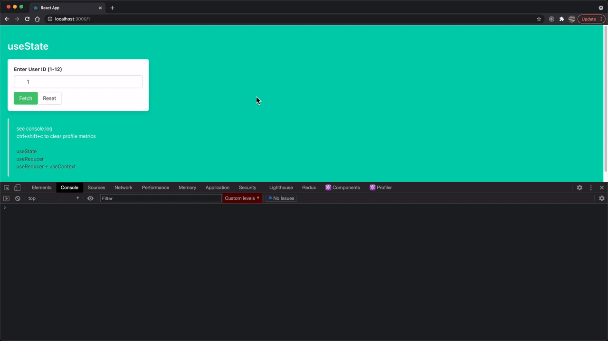
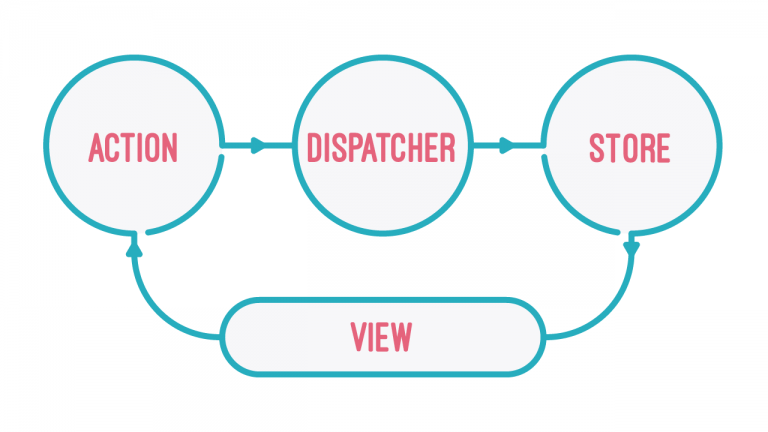

# What's This?

This repo is a teaching aid to understand the benefits of the [reducer](https://reactjs.org/docs/hooks-reference.html#usereducer) pattern as an everyday paradigm. (FYI: I love Redux but this repo doesn't use Redux at all.)

The examples were taken from [https://www.oncrashreboot.com/when-to-use-usestate-vs-usereducer-hook-in-react](https://www.oncrashreboot.com/when-to-use-usestate-vs-usereducer-hook-in-react) which is really a great starting place.

Dan Abramov (Co-author of Redux and Create React App) [on useReducer](https://twitter.com/dan_abramov/status/1102010093388947457)

Using the flux pattern to tackle complex business logic makes me [feel like this](https://youtu.be/bcLN5Yg8Jg0?t=261).

## Benefits of this Paradigm

- performance -> This repo includes a DevWrapper that keeps a tally of render cycles and render times. By comparing the render cycles of the useState example vs useReducer you'll see that the useReducer paradigm significantly limits render cycles.

- organization -> Using the reducer pattern allows for consolidating business logic outside of components. In turn those components can focus on just UI and dispatching (based on human interacting.. click this.. dispatch that). This makes components easier to reason about and test. I think this organization also can help teams collaboratively architect structure before any code is written.

- tests -> Testing reducers is arguably easier since they tend to be pure functions. Simply test the output based on input. Here is [a great article](https://dev.to/hbarcelos/a-better-approach-for-testing-your-redux-code-2ec9) about testing redux, but is applicable to all reducer patterns IMO. Also, when logic can be moved outside of components, components end up being simpler and easier to test.

## `yarn start`

- [http://localhost:3000/1](http://localhost:3000/1) simple initial useState example
- [http://localhost:3000/2](http://localhost:3000/2) refactor useState into useReducer example
- [http://localhost:3000/3](http://localhost:3000/3) more complex/real world-ish useReducer + useContext example (which uses tools from the amazing Redux Toolkit without the actual Redux)
